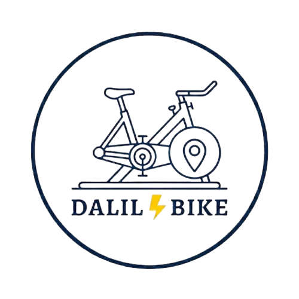

# Dalil Bike 🔋🚴

**CHARGE YOUR PHONE. FIND YOUR WAY.**

Dalil Bike is a sustainable energy and travel initiative designed for the modern explorer in Morocco. We bridge the gap between eco-friendly mobility and essential connectivity, providing interactive charging stations that power your journey through human kinetic energy.

---
---
---

## ✨ Application Features

In addition to our physical stations, the Dalil Bike digital platform provides:

- **Universal Search**: Find your way through a unified directory of Hubs (Cities), Stays (Hotels), and History (Landmarks).
- **Curated Stays**: Hand-picked accommodations across Morocco with high-quality visual galleries.
- **Heritage Guide**: Immersive editorial content about Moroccan historical sites and cultural heritage.
- **Multi-language Support**: Fully localized in English, French, Spanish, and Arabic.

## 🛠️ Technology Stack

- **Frontend**: [React 19](https://react.dev/) + [Vite](https://vitejs.dev/)
- **Styling**: [Tailwind CSS](https://tailwindcss.com/)
- **Animations**: [Framer Motion](https://www.framer.com/motion/)
- **Data**: Static JSON architecture for high performance and reliability.

## 🚀 Getting Started

1. **Clone**: `git clone git@github.com:hsami7/Dalil-Bike.git`
2. **Install**: `npm install`
3. **Dev**: `npm run dev`

---

*Sustainability in Motion. Connectivity in Every Mile.*
